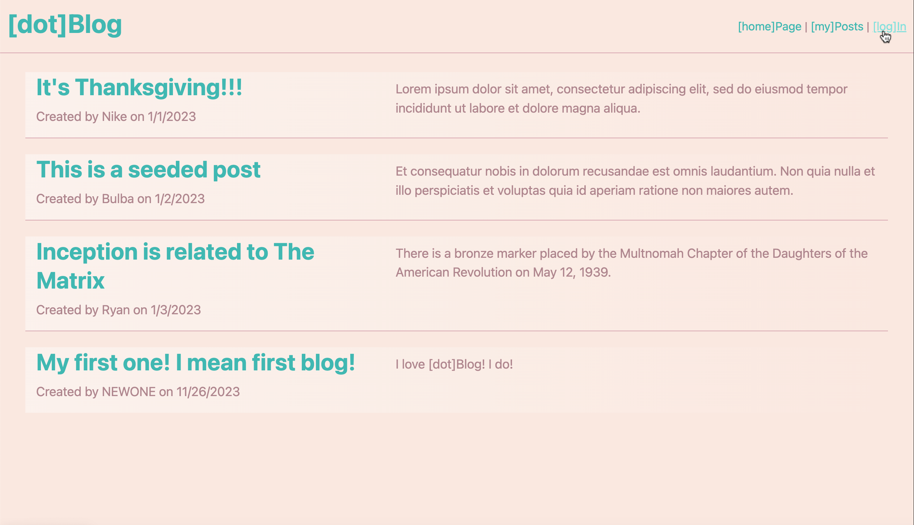
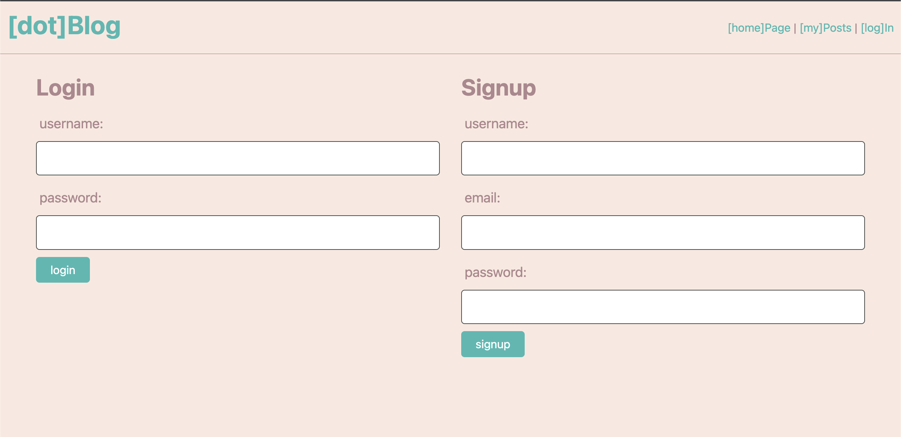
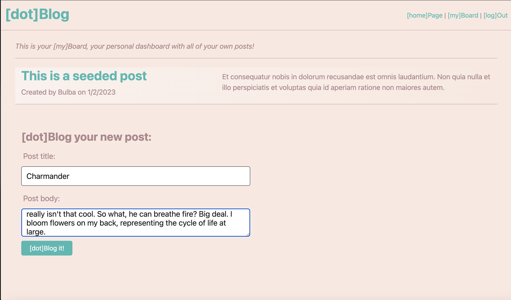
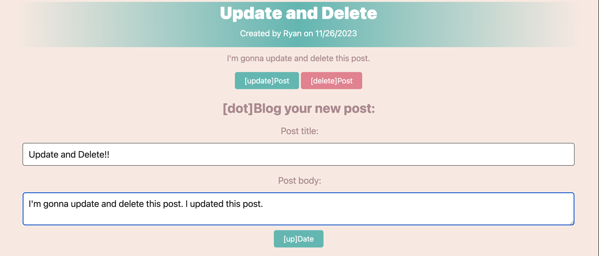
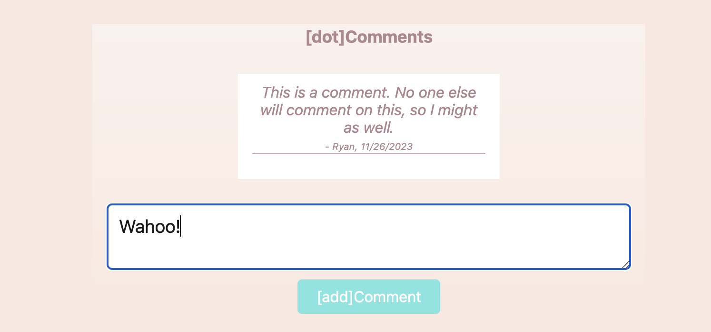

# \[dot\]Blog

## Description 📰

\[dot\]Blog is a basic blog site, where users can create, update, and delete their own posts. They can interact with others by also commenting on others' posts. This app, while basic, I'd like to think that it also was intentional by design. Social media is enough of a problem with so many ways one can personalize a connection with others -- which inevitably leads to unsolicited opinions and drama. The limited methods of connection and communication serves to limit and thereby solve the negative aspects of social media. All of the aforemention could have been the driving motivation behind this project. An additional source of motivation was to simply learn the basic groundwork of social media applications and build the foundation for another.  
I learned a lot in building this application: I learned more of the process that connects the backend to the frontend. Although bouncing around files is not ideal, I gained a familiarity with the flow of which files trigger others. Along the way, I learned how to make my own custom helper, how to log to console from handlebars, and that console logging things that dont exist in a backend route handler can have dire effects on the application as a whole!

## Table of Contents

&nbsp;&nbsp;&nbsp;&nbsp;&nbsp;&nbsp; ➣ [Installation](#Installation)

&nbsp;&nbsp;&nbsp;&nbsp;&nbsp;&nbsp; ➣ [Usage](#Usage)

&nbsp;&nbsp;&nbsp;&nbsp;&nbsp;&nbsp; ➣ [Contributing](#Contributing)

&nbsp;&nbsp;&nbsp;&nbsp;&nbsp;&nbsp; ➣ [Tests](#Tests)

&nbsp;&nbsp;&nbsp;&nbsp;&nbsp;&nbsp; ➣ [Credits](#Credits)

&nbsp;&nbsp;&nbsp;&nbsp;&nbsp;&nbsp; ➣ [Questions](#Questions)

## Installation 🔌

In order to install, please run `npm i`.

## Usage 🧮

In order to use this app, please run `npm start`, and to have pre-filled content, please run `npm run seed`.  

Upon landing on the site, the user can see all posts that have been made thus far on \[dot\]Blog. However, trying to go anywhere or interact with anything will simply lead the user to either log in or sign up.

  

  

Once signed up or logged in, the user can access all functionalities in \[dot\]Blog!
The user can access their \[my\]Board, their personal dashboard of their own posts, where they can add new posts.  

![In the user's [my]Board, they can see their own posts and have the option to make a new post](./images/dbboard.png)  

When the user clicks \[dot\]Post, a form will render where the user can enter their post title and post content/body. Upon submission, the post will render both in the site homepage and the user's \[my\]Board.  

  

When clicking on a title of a post in home or \[my\]Board, the user will then be able to view an individual post along with any comments on that post. If the post was created by the user, they will have the option to update or delete the post.  

![Individual \[dot\]Blog post.](./images/dbsinglepost.png)

When the user clicks on the \[update\]Post button, a form will render for them to update the current content of the post.  

  

After updating a post, the changes made will be reflected in homepage and \[my\]Board.
The user can also delete a post when viewing the individual post. Once clicked, the post will be deleted from history!

Additionally, anyone can comment on a post as long as they are logged in. After some idle time, the user will be automatically logged out.

Once done, the user will have the option to \[log\]Out at the top right of the screen where the \[log\]In button once was.  

Please enjoy your experience on this app, and remember to \[dot\]Blog it!

## Contributing 🍴

In order to contribute, one must fork their repository and create a pull request.

## Tests ⚖️

N/A

 ## Credits 🤝
  edX: connection.js, most of css folder, login.js, logout.js, auth.js, helpers.js (lines 1-6), most of main.handlebars, server.js

## Questions 📭

Please enjoy my work at my GitHub, @[mintyry](https://github.com/mintyry).
